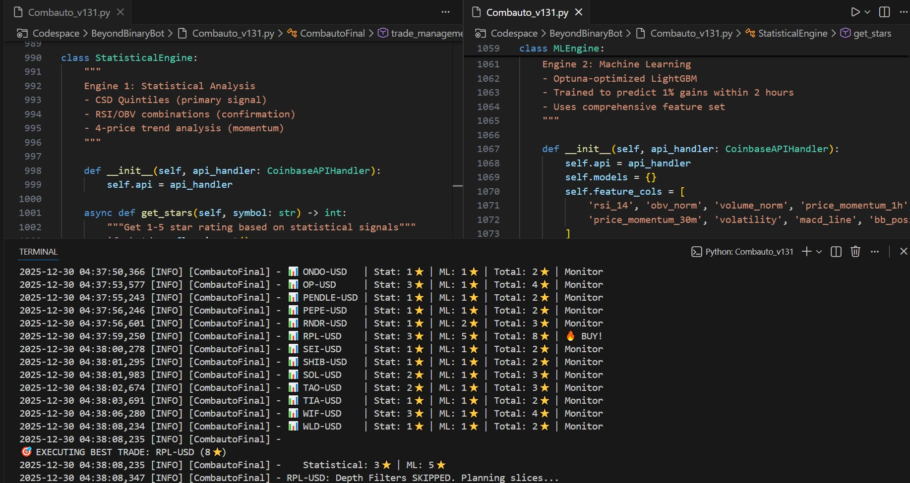

# Combauto v131 (Coinbase) — Statistical + ML Hybrid Trading Automation

This is a representative **“works right now”** release of **Combauto** — my Coinbase-based cryptocurrency trading automation.

It’s not meant to capture every iteration I’ve ever built (there are a lot), but it **does** include the foundational setup for:
- a **custom CSD** signal (quintile-style signal shaping)
- **SequenceMagnitude-style momentum logic** (foundational form)
- a **star-based “BUY rating” system** (Stat ⭐ + ML ⭐ → Total ⭐)
- a **hybrid scoring approach**: static/statistical signals + machine learning confirmation

> Developed and run primarily on Windows in VS Code, but intended to be OS-agnostic.



## What’s in here
- `Combauto_v131.py` — the bot
- `.env.example` — environment variable template (Coinbase API credentials go in your local `.env`)
- `requirements.txt` — Python dependencies
- `CHANGELOG.md` + `AIChatAndChanges.txt` — change notes (seeded from a recent implementation session)
- `sample_run.log` — short real run output (for reference)

## Quickstart

### 1) Create a virtual environment (recommended)
**Windows (PowerShell)**
```powershell
python -m venv .venv
.\.venv\Scripts\Activate.ps1
```

**macOS/Linux**
```bash
python3 -m venv .venv
source .venv/bin/activate
```

### 2) Install dependencies
```bash
pip install -r requirements.txt
```

### 3) Configure your Coinbase API credentials
Copy the example file and add your keys:
- Copy `.env.example` → `.env`
- Replace the placeholder values with your Coinbase API key and secret

**Do not commit `.env`.** (It’s ignored via `.gitignore`.)

### 4) Run
```bash
python Combauto_v131.py
```

## Runtime files (important)
This bot writes runtime state and outputs to a local folder (default):

- `data_combauto_v131_run2/`  positions, trade history, order state, logs, etc.)

If you’re experimenting, back this folder up and/or keep runs separated.

## Safety + responsibility
Read `../../DISCLAIMER.md` before running this against real funds.

## Notes for issues / debugging
If you open an issue, including the following (without secrets) makes it much easier to reproduce:
- Python version
- OS
- last ~50 log lines
- what symbol(s) you were trading
- any config values you changed
